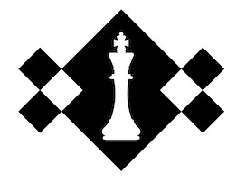

<center>
Chess tournament manager
</center> 

<p align="center">
  
</p>


## How do I run the Python script locally ?

#### 1. Install python and pip from the official website

    link : https://www.python.org/downloads/


#### 2. Open the shell

#### 3. Make sure pip is installed

```bash 
pip --version
# If you can see the pip version, then pip is installed correctly.
```


#### 4. Navigate into a work directory (ex "my documents) :

```bash 
# to navigate in a terminal:
  pwd               # print working directory
  ls                # list folder elements
  cd ..             # navigate to the parent folder
  cd 'name_dossier' # navigate to a son folder 
```

#### 5. Create a new folder "chess_game" where you could clone the repository :

```bash
  mkdir chess_game
```

#### 6. Navigate to chess_game/ :

```bash
  cd chess_game
```

#### 7. Clone the repository :

```bash
  git clone https://github.com/Nidal94320/OC_P4_CHESS_GAME.git
```

#### 8. Create a new virtuel environment through the command :

```bash
  python -m venv env
```

#### 9. Switch on the new virtuel environment you just created it :
```bash
env/Scripts/activate # under Windows
source env/bin/activate # under Mac
```
#### 10. Install required Python packages :

```bash
pip install –r requirements.txt
```
#### 11. Navigate to flake8_report/ :

```bash
  cd flake8_report
```
#### 12. Consult the Flake8 error report :

```bash
  start index.html # under Windows
  open index.html # under Mac
```
#### 13. Generate a new flake8 report :

```bash
cd ..
rm -r ./flake8_report/*
flake8
```

#### 14. Run the script to start CHESS_GAME :

```bash
python main.py

```
#### 15. Notice :

This is a script that is used offline via the terminal console.

There are 3 main menus in the game:

1. Player menu : where you can add, view, edit, or delete players from the system. It is important to know that 'ine' (the player's ID) is unique to each player, 7 characters long, and it is necessary to add a player first in the 'Player menu' before being able to add them to a tournament.

2. Tournament menu : where you can create, view, select, edit, or delete a tournament from the system. It is important to know (as the 'ine') that the tournament name is unique to each tournament.

3. Report menu : This is where you can export data created in the system as an Excel file. All reports are exported to the 'data/export' folder.


## Feedback/Question

If you have any feedback or questions, please reach out to me at nidalchateur@gmail.com
